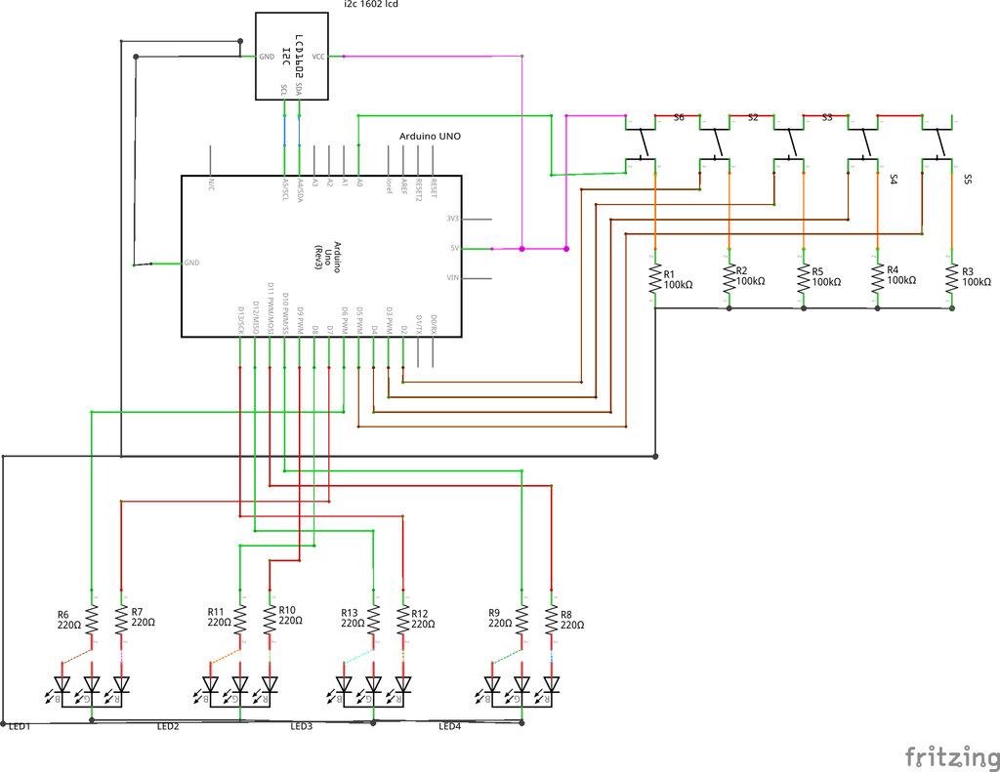

# Arduino Mastermind Game

A classic **Mastermind code-breaking game** implemented on Arduino Uno with an I2C LCD and RGB LEDs. Guess the secret 4-digit code using button inputs and LED feedback!

## Features
- **I2C LCD (1602A)** for displaying guesses and hints
- **4x push buttons** for digit input + **1x Enter button**
- **RGB LEDs** to show correct/wrong positions (Red = Correct, Blue = Wrong)
- **10 attempts** to crack the code
- Randomized secret codes (no repeating digits)

## Hardware Setup
- **Arduino Uno**
- **1602A LCD with I2C** (Address: `0x27` or `0x3F`)
- **4x Tactile buttons** (for digit selection)
- **1x Button** (for Enter)
- **4x RGB LEDs** (or 8x separate Red/Blue LEDs)
- Resistors: 220Ω for LEDs, 10kΩ pull-down for buttons

🔌 **Wiring Diagram**:  

## Software
- Libraries:
  - `LiquidCrystal_I2C` (for LCD)
  - `Wire` (I2C communication)
- **PlatformIO** or **Arduino IDE** compatible

## How to Play
1. Upload the code to Arduino.
2. The LCD will prompt you to start.
3. Use **buttons 1-4** to set each digit (0-9).
4. Press **Enter** to submit your guess.
5. LEDs will light up:
   - **Red** = Correct digit in the right position
   - **Blue** = Correct digit in the wrong position
6. Crack the code in ≤10 attempts!

## Example
 *(Optional: Add a photo/video later)*

## License
MIT License - Free for personal and educational use.
